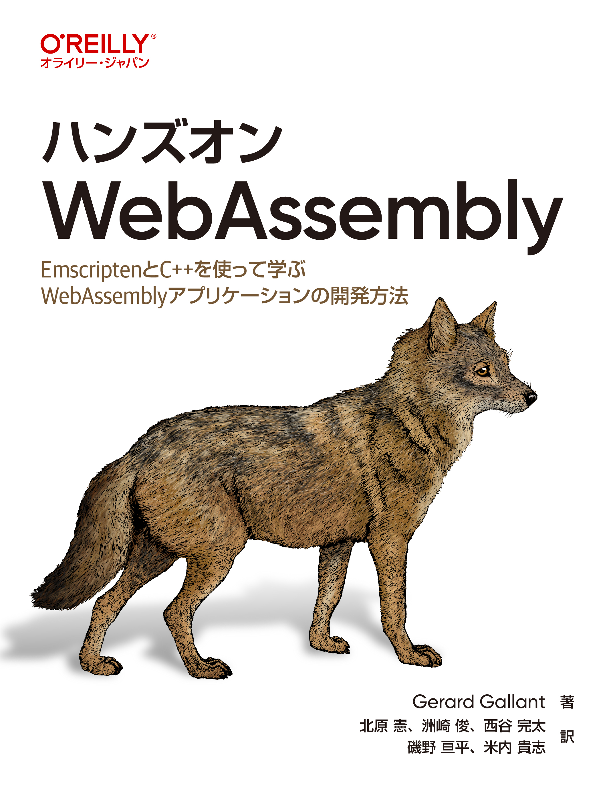

# ハンズオンWebAssembly

---



---

本リポジトリはオライリー・ジャパン発行書籍『[ハンズオンWebAssembly](https://www.oreilly.co.jp/books/9784814400102/)』のサポートサイトです。


## サンプルコード

* [3章のサンプルコード](./Chapter%203/)
* [4章のサンプルコード](./Chapter%204/)
* [5章のサンプルコード](./Chapter%205/)
* [6章のサンプルコード](./Chapter%206/)
* [7章のサンプルコード](./Chapter%207/)
* [8章のサンプルコード](./Chapter%208/)
* [9章のサンプルコード](./Chapter%209/)
* [10章のサンプルコード](./Chapter%2010/)
* [11章のサンプルコード](./Chapter%2011/)
* [12章のサンプルコード](./Chapter%2012/)
* [13章のサンプルコード](./Chapter%2013/)
* [付録Bのサンプルコード](./Appendix%20B/)
* [付録Cのサンプルコード](./Appendix%20C/)
* [付録Dのサンプルコード](./Appendix%20D/)
* [付録Eのサンプルコード](./Appendix%20E/)

コードやデータの解説は本書籍をご覧ください。

### 注意事項
日本語版のWindows OSを使用している場合は、EmscriptenでWebAssemblyモジュールをビルドする際に、Pythonの仕様の問題で次のようなエラーが発生する場合があります：

```
UnicodeDecodeError: 'cp932' codec can't decode byte 0x86 in position 82538: illegal multibyte sequence
```

この問題は、環境変数 `PYTHONUTF8` に `1` を設定すると解決できます。コマンドプロンプトから次のコマンドを実行してください：

```
set PYTHONUTF8=1
```

## 正誤表

まだありません。誤植など間違いを見つけた方は、japan@oreilly.co.jpまでお知らせください。

